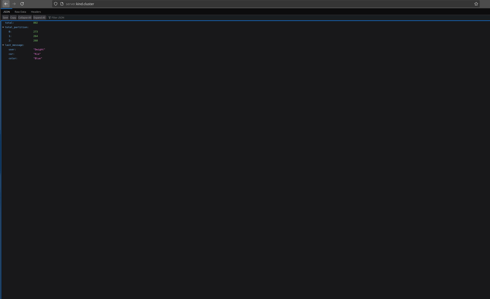
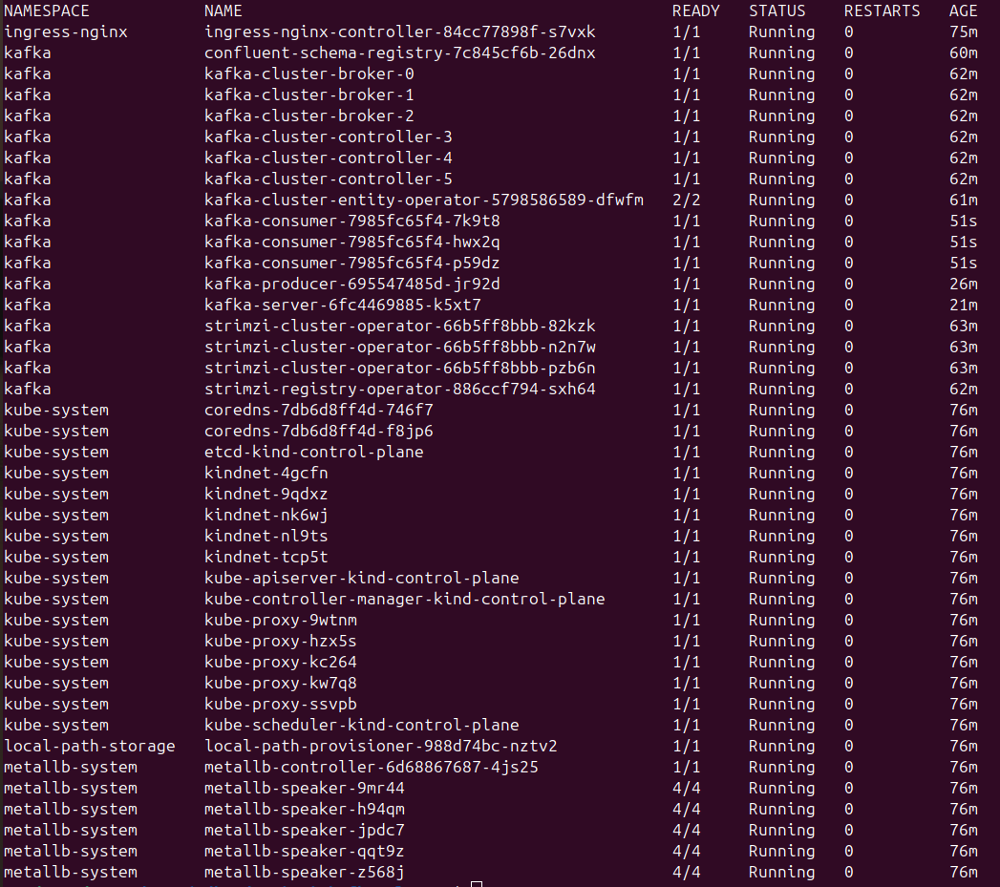

# Use Strimzi to setup Kafka cluster with Schema Registry in Kubernetes

Producer, Consumer and Schema Registry use mTLS to authentificate and authorize in Kafka Cluser.

## Requirements

- docker
- kubectl
- kind cli
- helm

## Setup kubernetes cluster

Run `./cluster-setup.sh` and you got 1 control-plane nodes and 3 worker nodes kubernetes cluster with installed ingress-nginx, metallb and 4 proxy image repository in docker containers in one network

## Deploy Kafka and Schema Registry

Run `./kafka-cluster.sh` to deploy 3 Kafka brocker and 3 Kafka KRaft control node and Schema Registry. Schema-registry required special user and topic to storage his data in Kafka so we deploy them too.

User deployed usind `KafkaUser` CR and named `confluent-schema-registry`.
Topic deployed usind `KafkaTopic` CR and named `registry-schemas`.

Mow we have running Kafka Cluser with Schema REgistry inside our `kafka` namespace.

You can access Schema registry at `http://schema.kind.cluster`

To load schema in schema registry see example in `schema-install.sh`

## Deploy example producer

First we must create example topic and user for connection to Kafka

Run `kubectl apply -f ./producer/manifests/kafka-user.yaml` to create user named `producer-user`

Run `kubectl apply -f ./producer/manifests/kafka-topic.yaml` to create topic named `example-topic` with 3 partition

Now we ready to deploy our producer:

Run `kubectl apply -f ./producer/manifests/deployment.yaml` to create producer.

Producer code can be find in `./producer` folder

It generates message with 1 second delay and random key from a list `Key-1, Key-2, Key-3`.

As a value we use struct which is filled also randomly:

```go

type message struct {
    User  string `json:"user"`
    Car   string `json:"car"`
    Color string `json:"color"`
}

```

Balance algoritm is `Hash` so message with equal key go to same partition.

## Deploy statistic server

Run `kubectl apply -f ./http_server/manifests/deployment.yaml` to deploy topic statistic server

Run `kubectl apply -f ./http_server/manifests/service.yaml` to deploy service

Run `kubectl apply -f ./http_server/manifests/service.yaml` to deploy ingress

Now statistic server opens at `server.kind.cluster`

## Deploy consumer

In this example we create 3 consumer in one consumer group named `example-group`

So each consumer will be consume one patrition.

Each consumer send information at statistic server so we can see how many message we receive total and by patrition.

Also we can see last message.

To deploy consumer group:

Run `kubectl apply -f ./consumer/manifests/kafka-user.yaml` to deploy consumer user named `consumer-user`.

Run `kubectl apply -f ./consumer/manifests/deployment.yaml` to deploy consumer group with 3 instances.

## Result

Example view of statistic server:



Kubernetes pod:


